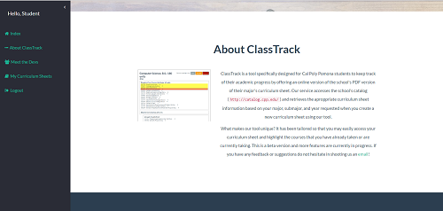

ClassTrack
--------

ClassTrack is a tool specifically designed for Cal Poly Pomona students to keep track of their academic progress by offering an online version of the school's PDF curriculum sheets.  

Environment Setup
--------

1. Install .NET Core SDK (dot.net)
2. Install Visual Studio (https://www.visualstudio.com/downloads/) [optional]

Features
--------
* Storage of individual curriculum sheets. An user has the option to store curriculum sheets by specifying their desired major, subplan, and year.
* Highlighting feature. Courses that have been taken or are being currently taken can be highlighted in different colors. Automatic save.

Screenshots 
--------

